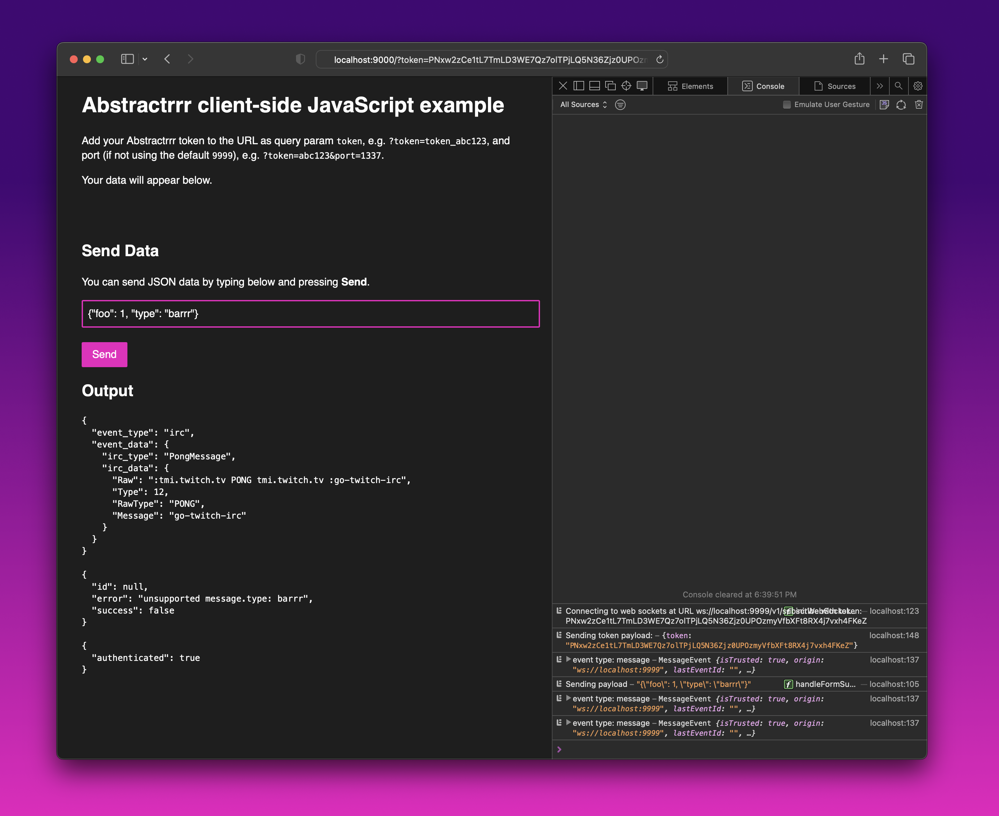

# Browser JavaScript example

Run a web server in the `./browser` directory:

```
./serve.sh
```

Once running, visit http://localhost:9000?token=MY_TOKEN where `MY_TOKEN` is your token. You can also add the `port` query param. If none provided, the default port 9999 will be used.

It will attempt to connect. If it's successful, you should see `{"authenticated": true}` and begin to see a feed of events sent over Abstractrrr.

**Note:** The screenshot below may be out of date.


